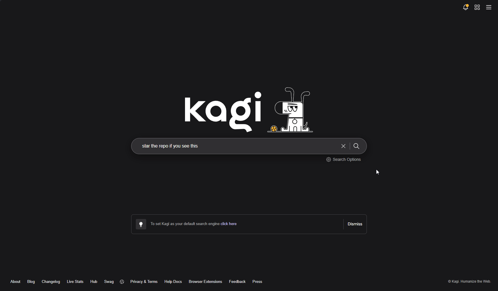

<p align="center">
  <picture>
    <source media="(prefers-color-scheme: dark)" srcset=".github/assets/kagi-cli-logo-dark.svg">
    <source media="(prefers-color-scheme: light)" srcset=".github/assets/kagi-cli-logo-light.svg">
    
  </picture>
</p>


<p align="center">
  <a href="https://github.com/Microck/kagi-cli/releases"></a>
  <a href="https://github.com/Microck/kagi-cli/actions/workflows/ci.yml"></a>
  <a href="LICENSE"></a>
</p>

---

`kagi` is a terminal CLI for Kagi that gives you command-line access to search, lenses, assistant, summarization, feeds, and paid API commands. it is built for people who want one command surface for interactive use, shell workflows, and structured JSON output.

the main setup path is your existing Kagi session-link URL. paste it into `kagi auth set --session-token` and the CLI extracts the token for you. if you also use Kagi's paid API, add `KAGI_API_TOKEN` and the public API commands are available too.

[documentation](https://kagi.micr.dev) | [npm](https://www.npmjs.com/package/kagi-cli) | [github](https://github.com/Microck/kagi-cli)


## why

if you already use Kagi and want to access it from scripts, shell workflows, or small tools, this CLI gives you a practical path without making the paid API flow the starting point.

- use your existing session-link URL for subscriber features
- get structured JSON for scripts, agents, and other tooling
- use one CLI for search, assistant, summarization, and feeds
- add `KAGI_API_TOKEN` only when you want the paid public API commands

## enhanced features

This modified version includes several powerful enhancements:

### Multiple Output Formats

Choose from 5 different output formats to suit your needs:

- **`json`** (default): Structured JSON for scripts and APIs
- **`pretty`**: Human-readable terminal display with colors
- **`compact`**: Minified JSON for reduced size
- **`markdown`**: Headers and links for documentation
- **`csv`**: Spreadsheet-compatible table format

```bash
kagi search "query" --format pretty
kagi search "query" --format markdown
kagi search "query" --format csv
```

### Parallel Batch Processing

Execute multiple searches concurrently with built-in rate limiting:

```bash
# Basic batch (3 concurrent, 60 requests/minute)
kagi batch "rust" "python" "go"

# Custom concurrency and rate limits
kagi batch "q1" "q2" "q3" --concurrency 5 --rate-limit 120

# Batch with different output formats
kagi batch "news" "weather" --format markdown
```

**Features:**
- Token bucket rate limiting algorithm
- Configurable concurrency (default: 3)
- Adjustable rate limits (default: 60 RPM)
- Lens support for scoped searches
- All output formats supported

### Colorized Output

Pretty format now includes colored output by default:

```bash
kagi search "query" --format pretty            # Colored output
kagi search "query" --format pretty --no-color # Disable colors
```

### Improved Error Handling

- Clear, actionable error messages
- Better rate limit handling
- Graceful fallback mechanisms

### Feature Comparison

| Feature | Original | Enhanced |
|---------|----------|----------|
| Output Formats | JSON only | JSON, Pretty, Compact, Markdown, CSV |
| Color Support | No | Yes (with `--no-color` option) |
| Batch Processing | No | Yes (parallel execution) |
| Rate Limiting | No | Yes (token bucket algorithm) |
| Autocomplete | No | Yes (Bash/Zsh/Fish/PowerShell) |
| Concurrency Control | No | Yes (`--concurrency` flag) |
| Interactive Help | Basic | Enhanced with examples |
| Error Handling | Basic | Improved messages |

## quickstart

### Linux or macOS

```bash
curl -fsSL https://raw.githubusercontent.com/Microck/kagi-cli/main/scripts/install.sh | sh
kagi --help
```

### Windows

```powershell
irm https://raw.githubusercontent.com/Microck/kagi-cli/main/scripts/install.ps1 | iex
kagi --help
```

### using a package manager

```bash
npm install -g kagi-cli
pnpm add -g kagi-cli
bun add -g kagi-cli

brew tap Microck/kagi
brew install kagi

scoop bucket add kagi https://github.com/Microck/scoop-kagi
scoop install kagi
```

### auth

add your subscriber session token:

how to get it:

1. click the top-right menu icon
2. go into `Settings`
3. click `Account` in the left sidebar
4. in `Session Link`, click `Copy`


```bash
kagi auth set --session-token 'https://kagi.com/search?token=...'
kagi auth check
```

add an api token when you want the paid public api commands:


how to get it:

1. click the top-right menu icon
2. go into `Settings`
3. click `Advanced` in the left sidebar
4. go into `Open API Portal`
5. under `API Token`, click `Generate New Token`



```bash
export KAGI_API_TOKEN='...'
```

## auth model

| credential | what it unlocks |
| --- | --- |
| `KAGI_SESSION_TOKEN` | base search, `search --lens`, `assistant`, `summarize --subscriber` |
| `KAGI_API_TOKEN` | public `summarize`, `fastgpt`, `enrich web`, `enrich news` |
| none | `news`, `smallweb`, `auth status` |

example config:

```toml
[auth]
# Full Kagi session-link URL or just the raw token value.
session_token = "https://kagi.com/search?token=kagi_session_demo_1234567890abcdef"

# Paid API token for summarize, fastgpt, and enrich commands.
api_token = "kagi_api_demo_abcdef1234567890"

# Base `kagi search` auth preference: "session" or "api".
preferred_auth = "api"
```
notes:

- `kagi auth set --session-token` accepts either the raw token or the full session-link URL
- environment variables override `.kagi.toml`
- base `kagi search` defaults to the session-token path when both credentials are present
- set `[auth] preferred_auth = "api"` if you want base search to prefer the API path instead
- `search --lens` always requires `KAGI_SESSION_TOKEN`
- `auth check` validates the selected primary credential without using search fallback logic

for the full command-to-token matrix, use the [`auth-matrix`](https://kagi.micr.dev/reference/auth-matrix) docs page.

## command surface

| command | purpose |
| --- | --- |
| `kagi search` | search Kagi with JSON by default or `--format pretty` for terminal output |
| `kagi auth` | inspect, validate, and save credentials |
| `kagi summarize` | use the paid public summarizer API or the subscriber summarizer with `--subscriber` |
| `kagi news` | read Kagi News from public JSON endpoints |
| `kagi assistant` | prompt Kagi Assistant with a subscriber session token |
| `kagi fastgpt` | query FastGPT through the paid API |
| `kagi enrich` | query Kagi's web and news enrichment indexes |
| `kagi smallweb` | fetch the Kagi Small Web feed |

for automation, stdout stays JSON by default. `--format pretty` only changes rendering for humans.

## building from source

To build and install the modified version with new features:

```bash
# Prerequisites: Install Rust
curl --proto '=https' --tlsv1.2 -sSf https://sh.rustup.rs | sh

# Clone the repository
git clone https://github.com/Microck/kagi-cli.git
cd kagi-cli

# Build the project
cargo build --release

# Install the binary
sudo cp target/release/kagi /usr/local/bin/kagi

# Verify installation
kagi --version
kagi --help
```

### Quick test without installation

```bash
# Build and run directly
cargo build --release
./target/release/kagi --help
./target/release/kagi search "test" --format pretty
```

### Shell completion setup

After installation, set up shell completions:

**Bash:**
```bash
kagi --generate-completion bash > /etc/bash_completion.d/kagi
source ~/.bashrc
```

**Zsh:**
```bash
kagi --generate-completion zsh > ~/.zsh/completion/_kagi
autoload -U compinit && compinit
```

**Fish:**
```bash
kagi --generate-completion fish > ~/.config/fish/completions/kagi.fish
```

## new features examples

### autocomplete

```bash
# After setting up completions, try:
kagi <TAB><TAB>
kagi search --format <TAB>
kagi batch --<TAB>
```

### output formats

```bash
# Pretty format with colors (default behavior)
kagi search "rust programming" --format pretty

# Pretty format without colors
kagi search "rust programming" --format pretty --no-color

# Markdown output
kagi search "rust programming" --format markdown

# CSV output
kagi search "rust programming" --format csv

# Compact JSON
kagi search "rust programming" --format compact
```

### batch searches with parallel execution

```bash
# Basic batch search (3 concurrent, 60 RPM default)
kagi batch "rust programming" "python tutorial" "go language"

# Custom concurrency and rate limiting
kagi batch "query1" "query2" "query3" --concurrency 5 --rate-limit 120

# Batch with different output formats
kagi batch "news today" "weather forecast" --format markdown

# Batch with lens support
kagi batch "tech news" "programming tips" --lens 1

# Batch with no color
kagi batch "query1" "query2" --format pretty --no-color
```

## examples

use search as part of a shell pipeline:

```bash
kagi search "what is mullvad"'
```

switch the same command to terminal-readable output:

```bash
kagi search --format pretty "how do i exit vim"
```

scope search to one of your lenses:

```bash
kagi search --lens 2 "developer documentation"
```

continue research with assistant:

```bash
kagi assistant "plan a focused research session in the terminal"
```

use the subscriber summarizer:

```bash
kagi summarize --subscriber --url https://kagi.com --summary-type keypoints --length digest
```

use the paid api summarizer:

```bash
kagi summarize --url https://example.com --engine cecil
```

get a faster factual answer through the paid api:

```bash
kagi fastgpt "what changed in rust 1.86?"
```

query enrichment indexes:

```bash
kagi enrich web "local-first software"
kagi enrich news "browser privacy"
```


## what it looks like

if you want a quick feel for the cli before installing it, this is the kind of output you get from the subscriber summarizer, assistant, and public news feed:


## documentation

- [installation guide](https://kagi.micr.dev/guides/installation)
- [quickstart guide](https://kagi.micr.dev/guides/quickstart)
- [authentication guide](https://kagi.micr.dev/guides/authentication)
- [workflows](https://kagi.micr.dev/guides/workflows)

## license

[mit license](LICENSE)

### todo
- add https://translate.kagi.com/
