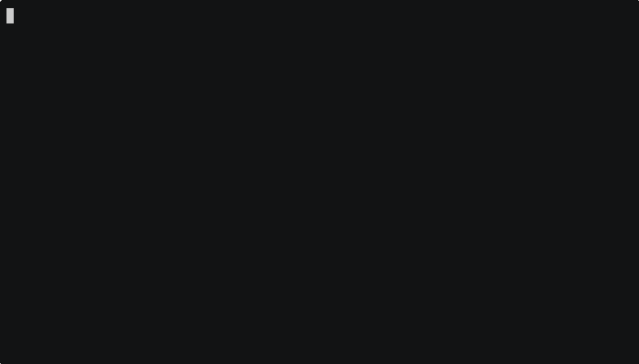

<p align="center">
  <picture>
    <source media="(prefers-color-scheme: dark)" srcset=".github/assets/kagi-cli-logo-dark.svg">
    <source media="(prefers-color-scheme: light)" srcset=".github/assets/kagi-cli-logo-light.svg">
    
  </picture>
</p>

# kagi

Agent-native CLI for Kagi subscribers. It defaults to structured JSON for automation and agents, with optional pretty terminal output for humans.

## Quickstart

Install the latest release:

```bash
curl -fsSL https://raw.githubusercontent.com/Microck/kagi-cli/main/scripts/install.sh | sh
kagi --help
```

On Windows:

```powershell
irm https://raw.githubusercontent.com/Microck/kagi-cli/main/scripts/install.ps1 | iex
kagi --help
```

Install with Node package managers:

```bash
npm install -g kagi-cli
pnpm add -g kagi-cli
bun add -g kagi-cli
kagi --help
```

Fastest commands that work without auth:

```bash
kagi news --category world --limit 3
kagi smallweb --limit 3
```

Search with subscriber auth:

```bash
export KAGI_SESSION_TOKEN='...'
kagi auth check
kagi search --pretty "rust lang"
```

Use paid public API commands:

```bash
export KAGI_API_TOKEN='...'
kagi summarize --url https://example.com
kagi fastgpt "Python 3.11"
```

## Installation

### Requirements

- A Kagi account token if you want authenticated commands

### Install the latest release

macOS and Linux:

```bash
curl -fsSL https://raw.githubusercontent.com/Microck/kagi-cli/main/scripts/install.sh | sh
```

Windows PowerShell:

```powershell
irm https://raw.githubusercontent.com/Microck/kagi-cli/main/scripts/install.ps1 | iex
```

The installers place `kagi` in a user-local bin directory and download the correct asset for your platform from GitHub Releases.

### Install with npm, pnpm, or bun

```bash
npm install -g kagi-cli
pnpm add -g kagi-cli
bun add -g kagi-cli
```

These package-manager installs still expose the same `kagi` command. The wrapper package downloads the native release binary for the current platform during install.

### Build locally from source

```bash
cargo build --release
./target/release/kagi --help
```

### Install from source with Cargo

```bash
cargo install --path .
kagi --help
```

### crates.io status

Crates.io publishing is not wired yet because both `kagi` and `kagi-cli` are already taken there. GitHub Releases are the canonical install path for now.

## Usage

Common flows:

```bash
kagi auth status
kagi auth set --session-token 'https://kagi.com/search?token=...'
kagi auth check
kagi search "rust lang"
kagi search --pretty "rust lang"
kagi search --lens 2 "rust lang"
kagi summarize --subscriber --url https://www.rust-lang.org/
kagi summarize --subscriber --summary-type keypoints --length digest --text '...'
kagi news --category world --limit 3
kagi news --list-categories
kagi news --chaos
kagi assistant 'Reply with the word pear.'
kagi summarize --url https://example.com
kagi fastgpt "Python 3.11"
kagi enrich web "rust lang"
kagi smallweb --limit 3
```

## Configuration

The CLI supports two credential types:

- `KAGI_API_TOKEN` - preferred for base search when your account has Search API access, and required for paid public API commands such as public summarizer, FastGPT, and enrichment
- `KAGI_SESSION_TOKEN` - required for lens-aware search, subscriber Summarizer, and Assistant

Credential precedence:

1. Environment variables
2. Local config file `.kagi.toml`

Example config file:

```toml
[auth]
api_token = "..."
session_token = "..."
```

Token setup notes:

- API token: generate it from `https://kagi.com/settings/api`
- Session token: use Kagi's Session Link flow
- `kagi auth set --session-token` accepts either the raw token value or the full Session Link URL and extracts `token=` automatically
- Lens-aware search currently requires a session token because lens transport is only proven on the HTML endpoint
- For base search, the CLI prefers `KAGI_API_TOKEN` when available. If Kagi rejects that token on the API path, the CLI falls back to `KAGI_SESSION_TOKEN` when one is configured

Environment example:

```bash
export KAGI_API_TOKEN='...'
export KAGI_SESSION_TOKEN='...'
```

See also: [`.env.example`](.env.example)

## CLI Reference

| Command | Purpose | Auth |
|---|---|---|
| `search` | Search Kagi and emit structured JSON | `KAGI_API_TOKEN` or `KAGI_SESSION_TOKEN` |
| `auth` | Inspect, store, and validate configured credentials | optional |
| `summarize` | Use the paid public summarizer or the subscriber web Summarizer | API token or session token depending on flags |
| `news` | Read Kagi News from live public JSON endpoints | none |
| `assistant` | Prompt Kagi Assistant and continue threads | `KAGI_SESSION_TOKEN` |
| `fastgpt` | Query Kagi's FastGPT API | `KAGI_API_TOKEN` |
| `enrich web` / `enrich news` | Query Kagi's enrichment APIs | `KAGI_API_TOKEN` |
| `smallweb` | Fetch the Kagi Small Web feed | none |

Command notes:

- `search --pretty` changes only stdout formatting
- `search --lens <INDEX>` uses the proven session-token HTML search path
- `summarize --subscriber` uses the subscriber web Summarizer, not the paid public API
- `news --list-categories` returns the current category inventory
- `news --chaos` returns the current chaos index and explanation
- `assistant --thread-id <THREAD_ID>` continues an existing Assistant thread

## Output Contract

Default output is JSON:

```json
{
  "data": [
    {
      "t": 0,
      "url": "https://example.com",
      "title": "Example",
      "snippet": "Example snippet"
    }
  ]
}
```

Pretty output changes only stdout formatting. Authentication, transport choice, errors, and exit behavior stay the same.

## Auth Behavior

- Base search prefers `KAGI_API_TOKEN` when available
- Base search falls back to `KAGI_SESSION_TOKEN` when no API token is configured
- Base search also falls back to `KAGI_SESSION_TOKEN` when Kagi rejects the API-token search path
- Lens search requires `KAGI_SESSION_TOKEN`
- `summarize --subscriber` requires `KAGI_SESSION_TOKEN`
- `assistant` requires `KAGI_SESSION_TOKEN`
- Public `summarize`, `fastgpt`, and `enrich` commands require `KAGI_API_TOKEN`
- `news` requires no auth
- `smallweb` requires no auth
- Missing, invalid, or unsupported credentials fail with explicit errors
- `auth check` validates the selected primary credential path without search fallback, so rejected API tokens still fail truthfully

## Command Details

### Summarize

- `kagi summarize` without `--subscriber` uses Kagi's paid public Summarizer API and requires `KAGI_API_TOKEN`
- `kagi summarize --subscriber` uses Kagi's subscriber web Summarizer and requires `KAGI_SESSION_TOKEN`
- Subscriber summarizer supports `--summary-type summary|keypoints|eli5`
- Subscriber summarizer supports `--length headline|overview|digest|medium|long`

### News

- `kagi news` uses Kagi News' public JSON endpoints and does not require auth
- The default category is `world`
- `--list-categories` returns the currently available batch categories with metadata
- `--chaos` returns the current Kagi News chaos index and explanation

### Assistant

- `kagi assistant` uses Kagi Assistant's authenticated `/assistant/prompt` stream and requires `KAGI_SESSION_TOKEN`
- The response includes the resolved thread id, so follow-up turns can continue with `--thread-id <ID>`

## Documentation

- [API coverage notes](docs/api-coverage.md)
- [Demo assets and regeneration steps](docs/demos.md)

## TODO

- Add `translate` back only after Kagi Translate has a live-verified Session Link compatible implementation. Current reverse-engineering notes live in [docs/handoff.md](docs/handoff.md).

## Demos

These GIFs are recorded with `asciinema` and rendered with the official asciinema `agg` binary.

### Search



### Subscriber Summarize


### News


### Assistant


## Architecture

The CLI has three main execution paths:

1. Documented paid API endpoints authenticated with `KAGI_API_TOKEN`
2. Subscriber web-product flows authenticated with `KAGI_SESSION_TOKEN`
3. Public product endpoints that require no auth, such as News and Small Web

Design constraints:

- JSON-first stdout keeps the CLI predictable for automation
- Human-readable terminal output is opt-in with `--pretty`
- Search can switch between official API and session-token HTML transport depending on command shape and available credentials
- Lens support is implemented on the live HTML/session path rather than the documented Search API

## Development

Run from a source checkout:

```bash
cargo run -- --help
cargo build --release
cargo test -q
```

Repo notes:

- Demo scripts live under `scripts/`
- Release installers live in `scripts/install.sh` and `scripts/install.ps1`
- Demo GIF regeneration steps live in [`docs/demos.md`](docs/demos.md)
- API and product coverage notes live in [`docs/api-coverage.md`](docs/api-coverage.md)

## Testing

Run the test suite:

```bash
cargo test -q
```

Current local baseline: 37 tests pass.

## Contributing

See [CONTRIBUTING.md](CONTRIBUTING.md) for local setup, pull request expectations, and auth-safe contribution guidance.

## Support

See [SUPPORT.md](SUPPORT.md) for bug reports, feature requests, and usage questions.

## Security

See [SECURITY.md](SECURITY.md). Do not report token-handling or authenticated-flow vulnerabilities in public issues.

## License

This project is licensed under the MIT License. See [LICENSE](LICENSE).
