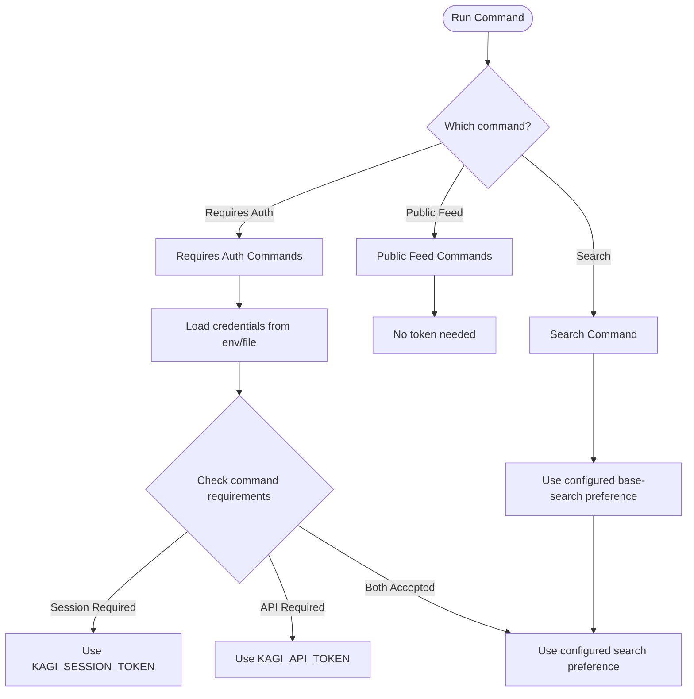

# Authentication Guide

Authentication is the foundation of the *kagi* CLI's functionality. This comprehensive guide explains the two credential types, how they're used, when each is required, and how to configure them securely.

## Recommended Setup Path

On a real terminal, the default setup path is:

```bash
kagi auth
```

The wizard lets you choose `Session Link` or `API Token`, points you to the correct Kagi settings page, accepts a paste, saves into `./.kagi.toml`, and validates the selected credential immediately.

Use `kagi auth set ...` only when you want a non-interactive or scripted flow.

## Authentication Overview

The *kagi* CLI supports two distinct credential types that unlock different capabilities:

### Session Token (`KAGI_SESSION_TOKEN`)

**What it is:** A token from your Kagi Session Link that authenticates you as a Kagi subscriber.

**Where it comes from:** Generated in your Kagi account settings as a Session Link URL.

**What it unlocks:**
- Subscriber-only web product features
- Lens-aware search (`kagi search --lens`)
- Session-backed filtered search
- Kagi Quick Answer (`kagi quick`)
- Kagi Assistant (`kagi assistant`)
- Custom assistant management (`kagi assistant custom`)
- Ask Page (`kagi ask-page`)
- Lens management (`kagi lens`)
- Custom bang management (`kagi bang custom`)
- Redirect rule management (`kagi redirect`)
- Kagi Translate (`kagi translate`)
- Subscriber Summarizer (`kagi summarize --subscriber`)
- Base search via the web product path

**Cost:** Included with your Kagi subscription (no additional charges)

### API Token (`KAGI_API_TOKEN`)

**What it is:** A token for Kagi's documented public APIs.

**Where it comes from:** Generated in your Kagi account settings under API.

**What it unlocks:**
- Public API endpoints
- FastGPT (`kagi fastgpt`)
- Public Summarizer (`kagi summarize` without `--subscriber`)
- Web/News Enrichment (`kagi enrich`)
- Base search via the Search API (if you have API access)

**Cost:** Requires available API credit (separate from subscription)

## Visual Authentication Flow



## Getting Your Tokens

### Obtaining a Session Token

Your Session Token is available in your Kagi account settings:

1. **Log into Kagi** at [kagi.com](https://kagi.com)
2. **Open** [Session Link settings](https://kagi.com/settings/user_details)
3. **Copy the full Session Link** that looks like:
   ```
   https://kagi.com/search?token=abc123def456...
   ```

**Important Security Notes:**
- This token authenticates as you - protect it like a password
- Anyone with this token can access your Kagi account features
- Don't commit it to version control
- Don't share it in public forums or chat
- Rotate it periodically if you suspect compromise

### Obtaining an API Token

Your API Token is available separately in API settings:

1. **Log into Kagi** at [kagi.com](https://kagi.com)
2. **Open** [API settings](https://kagi.com/settings/api)
3. **Generate a new token** if you don't have one
4. **Copy the token** (long alphanumeric string)

**Important API Notes:**
- API access requires available credit
- Monitor your usage in Kagi settings
- API calls consume credit per request
- Different endpoints may have different costs

## Token Lifecycle and Management

### Token Validity

| Token Type | Lifetime | Renewal |
|------------|----------|---------|
| Session Token | Long-lived (months) | Automatic via Kagi web session |
| API Token | Long-lived (months) | Manual regeneration in settings |

### Token Rotation

**When to rotate:**
- Suspected compromise
- Regular security maintenance (every 3-6 months)
- After team member departure
- After changing Kagi account password

**How to rotate:**

1. **Generate new token** in Kagi settings
2. **Update your configuration** with the new token
3. **Test** that new token works
4. **Revoke old token** in Kagi settings
5. **Remove old token** from any saved locations

## Configuration Methods

The *kagi* CLI supports two configuration methods with clear precedence:

### Method 1: Environment Variables (Highest Priority)

Environment variables take precedence over the config file, making them ideal for:
- CI/CD pipelines
- Docker containers
- Temporary testing
- Overriding file configuration

**Setting environment variables:**

**Bash/Zsh:**
```bash
export KAGI_SESSION_TOKEN='https://kagi.com/search?token=YOUR_TOKEN'
export KAGI_API_TOKEN='your_api_token'
```

**Fish:**
```fish
set -x KAGI_SESSION_TOKEN 'https://kagi.com/search?token=YOUR_TOKEN'
set -x KAGI_API_TOKEN 'your_api_token'
```

**PowerShell:**
```powershell
$env:KAGI_SESSION_TOKEN = 'https://kagi.com/search?token=YOUR_TOKEN'
$env:KAGI_API_TOKEN = 'your_api_token'
```

**Windows CMD:**
```cmd
set KAGI_SESSION_TOKEN=https://kagi.com/search?token=YOUR_TOKEN
set KAGI_API_TOKEN=your_api_token
```

**Docker:**
```dockerfile
ENV KAGI_SESSION_TOKEN=https://kagi.com/search?token=YOUR_TOKEN
ENV KAGI_API_TOKEN=your_api_token
```

**GitHub Actions:**
```yaml
env:
  KAGI_SESSION_TOKEN: ${{ secrets.KAGI_SESSION_TOKEN }}
  KAGI_API_TOKEN: ${{ secrets.KAGI_API_TOKEN }}
```

### Method 2: Configuration File

The `.kagi.toml` file provides persistent configuration:

**Location:**
- `./.kagi.toml` in the current working directory

**File format:**

```toml
[auth]
api_token = "your_api_token_here"
session_token = "https://kagi.com/search?token=your_session_token_here"
```

**Creating via the auth wizard:**

```bash
kagi auth
```

The wizard is the preferred setup flow.

**Creating via CLI flags:**

```bash
# Set session token (extracts token from URL automatically)
kagi auth set --session-token 'https://kagi.com/search?token=YOUR_TOKEN'

# Set API token
kagi auth set --api-token 'YOUR_API_TOKEN'

# Set both at once
kagi auth set --session-token 'https://kagi.com/search?token=SESSION_TOKEN' --api-token 'API_TOKEN'
```

**Creating manually:**

```bash
# macOS/Linux
cat > ./.kagi.toml << 'EOF'
[auth]
api_token = "your_api_token"
session_token = "https://kagi.com/search?token=your_session_token"
EOF

# Set secure permissions
chmod 600 ./.kagi.toml
```

```powershell
# Windows PowerShell
$content = @"
[auth]
api_token = `"your_api_token`"
session_token = `"https://kagi.com/search?token=your_session_token`"
"@
$content | Out-File -FilePath ".kagi.toml" -Encoding utf8
```

### Precedence Rules

Credentials are resolved in this order (first match wins):

```
1. Environment Variables (KAGI_API_TOKEN, KAGI_SESSION_TOKEN)
2. Configuration File (`./.kagi.toml`)
3. Missing (error for commands requiring auth)
```

This means:
- Environment variables override config file values
- You can temporarily test different tokens via env vars
- CI/CD can inject tokens without modifying files
- File configuration provides defaults, env vars provide overrides

**Example scenario:**

```bash
# Config file has default session token
cat ./.kagi.toml
# [auth]
# session_token = "https://kagi.com/search?token=DEFAULT_TOKEN"

# Override for this session only
export KAGI_SESSION_TOKEN='https://kagi.com/search?token=SPECIAL_TOKEN'

# This uses SPECIAL_TOKEN
kagi search "test"

# Unset to revert to file config
unset KAGI_SESSION_TOKEN

# This uses DEFAULT_TOKEN
kagi search "test"
```

## Authentication Verification

### Checking Status

See which credentials are configured:

```bash
kagi auth status
```

**Example outputs:**

No credentials:
```
selected: none
api token: not configured
session token: not configured
config path: .kagi.toml
```

Session token only:
```
selected: session-token (config)
api token: not configured
session token: configured via config
config path: .kagi.toml
```

Both tokens:
```
selected: api-token (env)
api token: configured via env
session token: configured via config
config path: .kagi.toml
```

### Validating Credentials

Test that configured credentials actually work:

```bash
kagi auth check
```

This command:
1. Loads credentials using precedence rules
2. Attempts a test search
3. Reports which token was used
4. Confirms authentication succeeds

**Example outputs:**

Session token valid:
```
auth check passed: session-token (config)
```

API token valid:
```
auth check passed: api-token (env)
```

Invalid or missing:
```
Error: missing credentials - this command requires KAGI_SESSION_TOKEN or KAGI_API_TOKEN
```

**Important:** `auth check` is intentionally strict and does not use the base-search fallback behavior. It tests the primary credential only.

## Command Authentication Requirements

### No Authentication Required

These commands work without any tokens:

- `kagi news` - Public news feed
- `kagi news --list-categories` - News categories
- `kagi news --chaos` - Chaos index
- `kagi smallweb` - Small Web feed
- `kagi auth status` - Check configuration

### Session Token Required

These commands require `KAGI_SESSION_TOKEN`:

- `kagi search --lens <INDEX>` - Lens-aware search
- `kagi search --region ...`, `--time ...`, `--from-date ...`, `--to-date ...`, `--order ...`, `--verbatim`, personalization flags - session-backed filtered search
- `kagi assistant` - AI Assistant
- `kagi assistant custom` - saved assistant CRUD
- `kagi quick` - Quick Answer
- `kagi ask-page` - Ask Assistant about one page
- `kagi lens` - lens CRUD and enable/disable
- `kagi bang custom` - custom bang CRUD
- `kagi redirect` - redirect rule CRUD and enable/disable
- `kagi translate` - Kagi Translate text mode
- `kagi summarize --subscriber` - Subscriber Summarizer
- Base search (if no API token configured)

### API Token Required

These commands require `KAGI_API_TOKEN`:

- `kagi fastgpt` - FastGPT queries
- `kagi enrich web` - Web enrichment
- `kagi enrich news` - News enrichment
- `kagi summarize` (without `--subscriber`) - Public Summarizer
- Base search (preferred path when API token available)

### Dual Token Support

Base search (`kagi search` without `--lens` or runtime filters) supports both tokens:

- **Defaults to session** unless `[auth.preferred_auth] = "api"`
- **Falls back to session token** only when API-first mode is enabled and the Search API rejects the request
- **Enables seamless operation** regardless of which token you have

See the [Auth Matrix](/reference/auth-matrix) for a complete reference.

## Search-Specific Authentication Behavior

The `kagi search` command has special authentication logic:

### Normal Operation

```mermaid
flowchart TD
    Start([User runs: kagi search "query"]) --> Filtered{Lens or runtime filters?}

    Filtered -->|Yes| NeedSession[Requires session token]
    NeedSession --> SessionPath1[Use web product path]
    SessionPath1 --> ReturnResults1[Return results]

    Filtered -->|No| Preference{[auth.preferred_auth] = api?}

    Preference -->|No or unset| PreferSession{Session token configured?}
    PreferSession -->|Yes| SessionPath2[Use web product path]
    SessionPath2 --> ReturnResults2[Return results]
    PreferSession -->|No| PreferApiFallback{API token configured?}
    PreferApiFallback -->|Yes| ApiPath1[Use Search API]
    ApiPath1 --> ReturnResults3[Return results]
    PreferApiFallback -->|No| Error1[Error]

    Preference -->|Yes| PreferApi{API token configured?}
    PreferApi -->|Yes| ApiPath2[Use Search API]
    ApiPath2 -->|Success| ReturnResults4[Return results]
    ApiPath2 -->|Auth error| SessionFallback{Session token configured?}
    SessionFallback -->|Yes| SessionPath3[Fallback to web product path]
    SessionPath3 --> ReturnResults5[Return results]
    SessionFallback -->|No| Error2[Error]
    PreferApi -->|No| SessionIfPresent{Session token configured?}
    SessionIfPresent -->|Yes| SessionPath4[Use web product path]
    SessionPath4 --> ReturnResults6[Return results]
    SessionIfPresent -->|No| Error3[Error]
```

### Base Search Behavior

The base search command follows the configured base-search preference.

**Scenario 1: Default session-first behavior**
```bash
export KAGI_SESSION_TOKEN='valid_token'
kagi search "test"
# Uses session token path directly
# Returns results
```

**Scenario 2: API-first mode works**
```bash
export KAGI_API_TOKEN='valid_token'
# .kagi.toml contains: [auth] preferred_auth = "api"
kagi search "test"
# Uses Search API, returns results
```

**Scenario 3: API-first mode rejected, fallback to session**
```bash
export KAGI_API_TOKEN='valid_token'
export KAGI_SESSION_TOKEN='also_valid'
# .kagi.toml contains: [auth] preferred_auth = "api"
kagi search "test"
# Tries Search API → gets auth error
# Falls back to session token path
# Returns results
```

**Scenario 4: No tokens**
```bash
kagi search "test"
# Error: missing credentials
```

**Important:** The fallback only happens for base search, not for other commands. This ensures predictable behavior while maximizing utility.

## Security Best Practices

### Token Storage

**DO:**
- ✅ Use `kagi auth` for local setup so the CLI validates the credential as you save it
- ✅ Store tokens in `./.kagi.toml` with 600 permissions
- ✅ Use environment variables in CI/CD secrets
- ✅ Use secret managers (1Password, Vault, etc.)
- ✅ Rotate tokens periodically

**DON'T:**
- ❌ Commit tokens to version control
- ❌ Hardcode tokens in scripts
- ❌ Share tokens in public channels
- ❌ Store tokens in plain text notes
- ❌ Include tokens in bug reports or logs

### Shell History

Be aware that `export KAGI_TOKEN=...` commands may be saved to shell history:

**Prevent history logging:**

```bash
# Bash - prefix with space
 export KAGI_SESSION_TOKEN='...'

# Or use read
read -s KAGI_SESSION_TOKEN
export KAGI_SESSION_TOKEN

# Clear history
history -d $((HISTCMD-1))
```

**Better approach:** Set tokens in shell profile (excluded from history) or use the config file.

### CI/CD Security

**GitHub Actions:**
```yaml
steps:
  - name: Run kagi command
    env:
      KAGI_SESSION_TOKEN: ${{ secrets.KAGI_SESSION_TOKEN }}
    run: kagi search "query"
```

**GitLab CI:**
```yaml
script:
  - kagi search "query"
variables:
  KAGI_SESSION_TOKEN: $KAGI_SESSION_TOKEN
```

**CircleCI:**
```yaml
steps:
  - run:
      command: kagi search "query"
      environment:
        KAGI_SESSION_TOKEN: ${KAGI_SESSION_TOKEN}
```

### Docker Security

**Avoid in Dockerfile:**
```dockerfile
# DON'T DO THIS
ENV KAGI_SESSION_TOKEN=actual_token
```

**Correct approach:**
```dockerfile
# Dockerfile
FROM alpine
RUN apk add --no-cache curl && \
    curl -fsSL ... | sh
# Don't set tokens here
```

```bash
# docker run
docker run -e KAGI_SESSION_TOKEN="$KAGI_SESSION_TOKEN" myimage kagi search "test"
```

### Team Sharing

**For shared development environments:**

1. **Each developer** has their own tokens
2. **Use environment-specific config** (not committed)
3. **Document setup** in README (without actual tokens)
4. **Use secret managers** for shared CI/CD

**Example `.env.example` (safe to commit):**
```bash
# Copy to .env and fill in your tokens
KAGI_SESSION_TOKEN=
KAGI_API_TOKEN=
```

**Example `.env` (NEVER commit):**
```bash
KAGI_SESSION_TOKEN=https://kagi.com/search?token=...
KAGI_API_TOKEN=...
```

## Troubleshooting Authentication

### "missing credentials" Error

**Cause:** Command requires authentication but no valid token found.

**Solutions:**
1. Check current status: `kagi auth status`
2. Verify token is set: `echo $KAGI_SESSION_TOKEN`
3. Set token if missing: `kagi auth` or `kagi auth set --session-token '...'`
4. Check correct variable name (SESSION not SESSSION)

### "auth check failed" Error

**Cause:** Token is set but invalid, expired, or revoked.

**Solutions:**
1. Verify token in Kagi settings
2. Check token hasn't expired
3. Regenerate if necessary
4. Update configuration with new token

### "this command requires KAGI_SESSION_TOKEN"

**Cause:** Attempting to use subscriber features with only API token.

**Solutions:**
1. Get Session Token from Kagi settings
2. Set session token: `kagi auth` or `kagi auth set --session-token '...'`
3. Verify: `kagi auth status`

### "this command requires KAGI_API_TOKEN"

**Cause:** Attempting to use API features without API token.

**Solutions:**
1. Get API Token from Kagi settings
2. Check you have API credit available
3. Set API token: `kagi auth` or `kagi auth set --api-token '...'`
4. Verify: `kagi auth status`

### Token Not Being Used from Config File

**Cause:** Environment variable is overriding file.

**Check:**
```bash
kagi auth status
# Shows source: "env" or "file"
```

**Solution:**
```bash
# Check for env var
env | grep KAGI

# Unset if needed
unset KAGI_SESSION_TOKEN
unset KAGI_API_TOKEN
```

### Session Link URL Not Working

**Cause:** CLI expects either full URL or just token.

**Solution:**
```bash
# Either format works:
kagi auth set --session-token 'https://kagi.com/search?token=abc123'
kagi auth set --session-token 'abc123'
```

## Advanced Configuration

### Platform-Specific Configuration

**macOS Keychain (alternative storage):**

```bash
# Store in keychain
security add-generic-password -s "kagi-session" -a "$USER" -w "your_token"

# Retrieve and use
export KAGI_SESSION_TOKEN=$(security find-generic-password -s "kagi-session" -w)
```

**Windows Credential Manager:**

```powershell
# Store credential
$credential = Get-Credential -Message "Enter Kagi Session Token"
$credential.Password | ConvertFrom-SecureString | Out-File "$env:USERPROFILE\.kagi_session.cred"

# Use in scripts
$secureString = Get-Content "$env:USERPROFILE\.kagi_session.cred" | ConvertTo-SecureString
$BSTR = [System.Runtime.InteropServices.Marshal]::SecureStringToBSTR($secureString)
$env:KAGI_SESSION_TOKEN = [System.Runtime.InteropServices.Marshal]::PtrToStringAuto($BSTR)
```

### Multiple Profiles

For users with multiple Kagi accounts:

```bash
# Create wrapper scripts
#!/bin/bash
# kagi-work
export KAGI_SESSION_TOKEN='work_account_token'
kagi "$@"

#!/bin/bash
# kagi-personal
export KAGI_SESSION_TOKEN='personal_account_token'
kagi "$@"
```

Or use environment-specific files:

```bash
# .kagi-work.toml
[auth]
session_token = "work_token"

# .kagi-personal.toml
[auth]
session_token = "personal_token"

# Switch profiles
alias kagi-work='KAGI_SESSION_TOKEN=work_token kagi'
alias kagi-personal='KAGI_SESSION_TOKEN=personal_token kagi'
```

## Summary

**Key takeaways:**

1. **Two token types:** Session (subscriber features) and API (paid API features)
2. **Best local setup path:** `kagi auth`
3. **Clear precedence:** Environment variables override config files
4. **Configured search preference:** Base search defaults to session unless `[auth.preferred_auth] = "api"`
5. **Security first:** Never commit tokens, rotate regularly, use secret managers
6. **Easy verification:** Use `kagi auth status` and `kagi auth check`

**Remember:**
- Session Token = Personal subscription features
- API Token = Paid API endpoints
- Both can coexist, each serves different commands
- Base search follows the configured search preference

## Next Steps

- **[Auth Matrix](/reference/auth-matrix)** - Complete command-to-token mapping
- **[Workflows](/guides/workflows)** - Real-world authentication patterns
- **[Troubleshooting](/guides/troubleshooting)** - More auth debugging help
- **[Support and Contribution](/project/support)** - Safe handling and contribution notes

---

*Keep your tokens secure and happy searching!*
