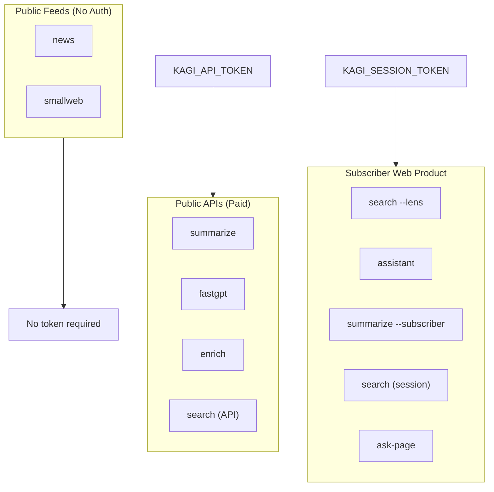

# *kagi* CLI Documentation

Welcome to the documentation for `kagi`, a Rust-based command-line interface for Kagi search, subscriber features, public feeds, and API-backed workflows. This site covers installation, authentication, command behavior, and practical ways to use the CLI from your terminal.

## What is *kagi*?

`kagi` brings Kagi into the terminal with structured JSON output by default and human-friendly formatting when you want it. The CLI wraps a mix of documented Kagi APIs, subscriber web-product flows, and public product endpoints behind one command surface.

### Core Philosophy

The *kagi* CLI was designed with three fundamental principles in mind:

1. **Automation-First**: Every command outputs structured JSON by default, making the CLI predictable and scriptable for automation, CI/CD pipelines, and other tooling.

2. **Progressive Enhancement**: Start with simple commands and gradually unlock more powerful features as you need them. The CLI grows with your usage patterns.

3. **Transparency**: Clear auth requirements, explicit error messages, and documented behavior. No hidden magic or opaque fallback mechanisms.

## Why Use *kagi*?

### For Developers and Engineers

If you live in the terminal, *kagi* brings Kagi's exceptional search quality directly to your workflow:

- **Script Integration**: Pipe search results into other tools, extract specific fields with `jq`, or incorporate Kagi search into your build scripts and automation workflows.

- **JSON-Native**: Every command returns structured data that you can programmatically process, transform, and store.

- **Version Control Friendly**: Configuration lives in a simple TOML file that can be committed to dotfiles repositories or shared across teams.

### For Automation and Tooling

The CLI is built to work cleanly in scripted and tool-driven environments:

- **Deterministic Output**: Consistent JSON schemas make downstream parsing and processing reliable.

- **Exit Codes**: Proper exit codes (0 for success, 1 for errors) enable shell scripting and workflow orchestration.

- **No Interactive Prompts**: All commands are fully scriptable with flags and environment variables.

### For Power Users

Unlock the full potential of your Kagi subscription:

- **Lens-Aware Search**: Use your custom Kagi lenses directly from the command line.

- **Assistant Integration**: Prompt Kagi Assistant programmatically, continue conversations, and manage threads across sessions.
- **Ask Page**: Start a page-focused Assistant thread directly from one URL and one question.

- **Subscriber Features**: Access subscriber-only capabilities like the web-based Summarizer with full control over output length and style.

## Feature Overview

### Search Capabilities

The `kagi search` command provides multiple pathways depending on your authentication and needs:

- **Base Search**: Standard Kagi search with high-quality results
- **API Token Path**: Uses the documented Search API when you have API access
- **Session Token Path**: Uses the subscriber web product for enhanced capabilities
- **Lens Search**: Scope searches to your personal Kagi lenses (requires session token)
- **Automatic Fallback**: Intelligently falls back from API to session path when appropriate

### Authentication Flexibility

Two credential types serve different purposes:

- **KAGI_SESSION_TOKEN**: Unlocks subscriber features including lens search, Assistant, and subscriber Summarizer. Obtained from your Kagi Session Link URL.

- **KAGI_API_TOKEN**: Enables paid public API commands including FastGPT, public Summarizer, and enrichment APIs. Requires API credit.

### Content Processing

- **Summarization**: Both paid public API and subscriber web paths with multiple engines, styles, and output lengths
- **FastGPT**: Quick answers powered by Kagi's FastGPT API
- **Enrichment**: Query specialized web and news indexes
- **Assistant**: Full conversation support with thread continuation and thread management
- **Ask Page**: Page-focused Assistant questions with structured output

### Public Feeds

Access Kagi's curated content without authentication:

- **News**: Kagi News with category filtering and chaos index
- **Small Web**: Curated feed from the independent web

## Architecture at a Glance

Understanding how *kagi* works helps you make informed decisions about authentication and command selection:

### Three Execution Paths



### JSON-First Design

All commands follow a consistent output contract:

1. **Default**: Machine-readable JSON on stdout
2. **Pretty Mode**: Human-friendly formatting with `--format pretty` flag
3. **Errors**: Clear error messages on stderr with appropriate exit codes
4. **Consistency**: Same command semantics regardless of output format

## Quick Navigation

Choose your path based on your current needs:

### Getting Started
- **[Installation](/guides/installation)** - Install *kagi* on macOS, Linux, or Windows
- **[Quickstart](/guides/quickstart)** - Get your first successful command running in minutes
- **[Authentication](/guides/authentication)** - Understand token types and setup

### Using *kagi*
- **[Workflows](/guides/workflows)** - Common patterns and real-world examples
- **[Commands](/commands/search)** - Detailed command reference with examples
- **[Advanced Usage](/guides/advanced-usage)** - Scripting, CI/CD, and automation

### Reference
- **[Auth Matrix](/reference/auth-matrix)** - Which commands need which tokens
- **[Output Contract](/reference/output-contract)** - JSON schemas and pretty mode
- **[Error Reference](/reference/error-reference)** - Common errors and solutions
- **[Troubleshooting](/guides/troubleshooting)** - Debugging and FAQ

## System Requirements

### Supported Platforms

- **macOS**: 10.15 (Catalina) and later, Intel and Apple Silicon
- **Linux**: x86_64 and ARM64 architectures
- **Windows**: Windows 10 and later, PowerShell 5.1+

### Runtime Requirements

- No runtime dependencies (self-contained binary)
- Network connectivity to kagi.com
- Shell environment (Bash, Zsh, Fish, PowerShell, or CMD)

### Optional Requirements

- **For scripting**: `jq` for JSON processing (recommended)
- **For development**: Rust toolchain 1.70+
- **For npm install**: Node.js 16+ and npm, pnpm, or bun

## Design Principles in Practice

### Example: Search Command Behavior

Consider the `kagi search` command. It demonstrates several design principles:

```bash
# JSON output for automation
kagi search "rust programming" | jq '.data[0].url'

# Pretty output for humans
kagi search --format pretty "rust programming"

# Lens search for subscriber features
kagi search --lens 2 "developer documentation"
```

Each variant uses the same underlying command but adapts output and capabilities based on flags and authentication. The command intelligently selects the appropriate transport (API vs session) and handles fallback automatically.

### Example: Authentication Precedence

The CLI follows a clear precedence model:

1. Environment variables (`KAGI_API_TOKEN`, `KAGI_SESSION_TOKEN`)
2. Local configuration file (`.*kagi*.toml`)
3. Command-specific requirements

This means you can override file-based configuration with environment variables for specific workflows or CI/CD environments.

## Next Steps

Ready to get started? Here's the recommended learning path:

1. **[Install *kagi*](/guides/installation)** - Choose your preferred installation method
2. **[Run your first command](/guides/quickstart)** - Start with no-auth commands like `kagi news`
3. **[Set up authentication](/guides/authentication)** - Configure your tokens for subscriber features
4. **[Explore workflows](/guides/workflows)** - See real-world usage patterns
5. **[Deep dive into commands](/commands/search)** - Master the full command surface

## Getting Help

If you encounter issues or have questions:

- **Documentation**: Search this documentation using the search bar above
- **GitHub Issues**: Report bugs or request features at [github.com/Microck/kagi-cli](https://github.com/Microck/kagi-cli)
- **Troubleshooting**: Check the [troubleshooting guide](/guides/troubleshooting) for common issues
- **Community**: Join discussions and share workflows with other users

## Contributing

The *kagi* CLI is open source and welcomes contributions. See the [Development Guide](/project/development) for:

- Building from source
- Development workflow
- Testing procedures
- Documentation improvements

---

*Last updated: March 2026 | kagi CLI v0.2.0*
