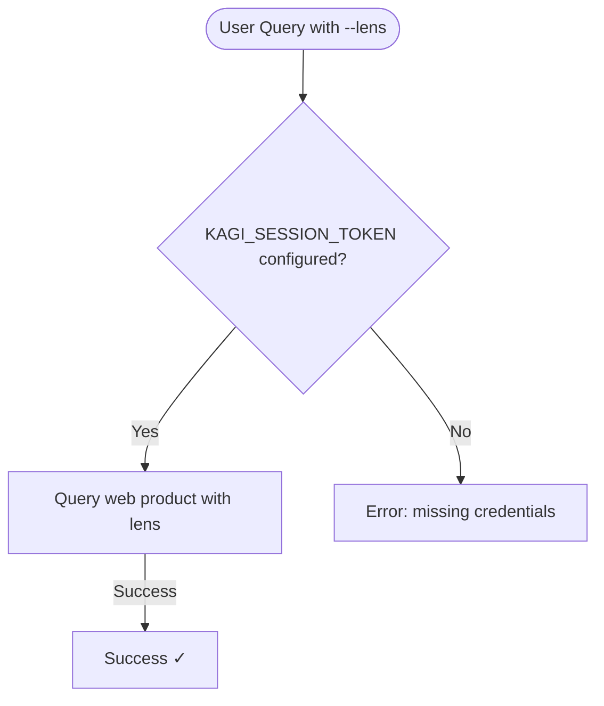
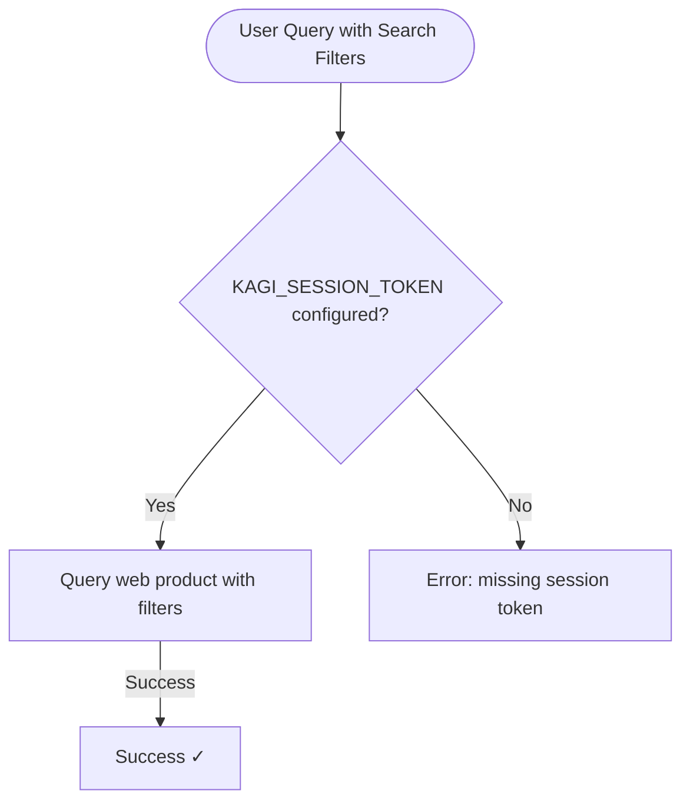

# Authentication Matrix

This reference provides a complete mapping of which commands require which authentication tokens, including fallback behavior and special cases.

## Command Overview

| Command | Preferred Auth | Fallback | Notes |
|---------|---------------|----------|-------|
| `search` (base) | Configured base-search preference | Session fallback only when API-first mode is enabled | Defaults to session unless `[auth.preferred_auth] = "api"` |
| `search --lens` | `KAGI_SESSION_TOKEN` | None | Lens requires session token |
| `search` with filters | `KAGI_SESSION_TOKEN` | None | Region, time, date, order, verbatim, and personalization filters require session token |
| `auth status` | None | None | Reads config only |
| `auth check` | Primary credential | None | Tests selected token |
| `auth set` | None | None | Saves credentials |
| `summarize` | `KAGI_API_TOKEN` | None | Paid public API |
| `summarize --subscriber` | `KAGI_SESSION_TOKEN` | None | Subscriber web product |
| `news` | None | None | Public endpoint |
| `ask-page` | `KAGI_SESSION_TOKEN` | None | Subscriber feature |
| `assistant` | `KAGI_SESSION_TOKEN` | None | Subscriber feature |
| `fastgpt` | `KAGI_API_TOKEN` | None | Paid public API |
| `enrich web` | `KAGI_API_TOKEN` | None | Paid public API |
| `enrich news` | `KAGI_API_TOKEN` | None | Paid public API |
| `smallweb` | None | None | Public feed |

## Detailed Breakdown

### Search Commands

#### Base Search (`kagi search`)

```mermaid
flowchart TD
    Start([User Query]) --> Pref{[auth.preferred_auth] = api?}

    Pref -->|No or unset| CheckSession{KAGI_SESSION_TOKEN configured?}
    CheckSession -->|Yes| TryWeb[Try web product]
    TryWeb -->|Success| ReturnResults1[Return results ✓]
    CheckSession -->|No| CheckAPI1{KAGI_API_TOKEN configured?}
    CheckAPI1 -->|Yes| TryAPI1[Try Search API]
    TryAPI1 -->|Success| ReturnResults2[Return results ✓]
    CheckAPI1 -->|No| Error1[Error: missing credentials]

    Pref -->|Yes| CheckAPI2{KAGI_API_TOKEN configured?}
    CheckAPI2 -->|Yes| TryAPI2[Try Search API]
    TryAPI2 -->|Success| ReturnResults3[Return results ✓]
    TryAPI2 -->|Auth error| CheckSession2{KAGI_SESSION_TOKEN configured?}
    CheckSession2 -->|Yes| TryWebFallback[Try web product]
    TryWebFallback -->|Success| ReturnResults4[Success ✓]
    CheckSession2 -->|No| Error2[Error: auth failed]
    CheckAPI2 -->|No| CheckSession3{KAGI_SESSION_TOKEN configured?}
    CheckSession3 -->|Yes| TryWeb2[Try web product]
    TryWeb2 -->|Success| ReturnResults5[Return results ✓]
    CheckSession3 -->|No| Error3[Error: missing credentials]
```

**Key insight:** Base search is the only command with fallback behavior, and that fallback only matters when you explicitly opt into API-first mode.

#### Lens Search (`kagi search --lens <INDEX>`)



**No fallback:** Lens search requires session token exclusively.

#### Filtered Search (`kagi search --region ...`, `--time ...`, etc.)



**No fallback:** filtered search requires session token exclusively.

### Authentication Commands

#### `kagi auth status`

- **Purpose:** Display current configuration
- **Network:** No
- **Reads:** Environment variables, config file
- **Output:** Shows which tokens are configured and their sources

#### `kagi auth check`

- **Purpose:** Validate credentials work
- **Network:** Yes (test search)
- **Uses:** Primary credential (API if available, else session)
- **No fallback:** Tests primary credential only

#### `kagi auth set`

- **Purpose:** Save credentials to file
- **Network:** No
- **Writes:** `./.kagi.toml`
- **Creates:** Config file if doesn't exist

### Content Commands

#### Summarization

| Mode | Token | Notes |
|------|-------|-------|
| Public API (default) | `KAGI_API_TOKEN` | Uses Universal Summarizer API |
| Subscriber (`--subscriber`) | `KAGI_SESSION_TOKEN` | Uses web product summarizer |

**Important:** These are mutually exclusive. You cannot use `--subscriber` with API-only options like `--engine`.

#### AI Commands

| Command | Token | Purpose |
|---------|-------|---------|
| `ask-page` | `KAGI_SESSION_TOKEN` | Ask Assistant about one page URL |
| `assistant` | `KAGI_SESSION_TOKEN` | Conversational AI with threads |
| `fastgpt` | `KAGI_API_TOKEN` | Quick factual answers |

### Data Commands

#### Enrichment

Both `enrich web` and `enrich news` require `KAGI_API_TOKEN`:

- **Teclis** (web) - Enhanced web search
- **TinyGem** (news) - Enhanced news search

### Feed Commands

#### Public Feeds (No Auth Required)

| Command | Endpoint | Update Frequency |
|---------|----------|------------------|
| `news` | Kagi News | Continuous |
| `smallweb` | Small Web | Periodic |

## Token Requirements by Feature

### Session Token Features

Requires `KAGI_SESSION_TOKEN`:

- ✅ Lens-aware search (`--lens`)
- ✅ Filtered search (`--region`, `--time`, `--from-date`, `--to-date`, `--order`, `--verbatim`, personalization flags)
- ✅ Kagi Assistant prompt and thread commands (`assistant`)
- ✅ Ask Page (`ask-page`)
- ✅ Subscriber Summarizer (`summarize --subscriber`)
- ✅ Base search (fallback)

### API Token Features

Requires `KAGI_API_TOKEN`:

- ✅ FastGPT (`fastgpt`)
- ✅ Public Summarizer (`summarize`)
- ✅ Web Enrichment (`enrich web`)
- ✅ News Enrichment (`enrich news`)
- ✅ Base search when `[auth.preferred_auth] = "api"`

### No Token Required

Works without authentication:

- ✅ Kagi News (`news`)
- ✅ Small Web (`smallweb`)
- ✅ Auth status (`auth status`)

## Configuration Precedence

### Resolution Order

```
1. Environment Variables (KAGI_API_TOKEN, KAGI_SESSION_TOKEN)
   ↓ (if not set)
2. Configuration File (`./.kagi.toml`)
   ↓ (if not set)
3. Missing (error for commands requiring auth)
```

### Example Scenarios

**Scenario 1: Both tokens in file**
```toml
# ./.kagi.toml
[auth]
api_token = "api123"
session_token = "session456"
```
- `search`: Uses the configured base-search preference (session by default)
- `assistant`: Uses session token
- `news`: No token needed

**Scenario 2: Mixed sources**
```bash
export KAGI_API_TOKEN="api789"
# ./.kagi.toml has session_token only
```
- `search`: Uses env API token (takes precedence)
- `summarize --subscriber`: Uses file session token
- `fastgpt`: Uses env API token

**Scenario 3: Environment overrides file**
```bash
export KAGI_SESSION_TOKEN="special_session"
# ./.kagi.toml has different session_token
```
- `search`: Uses env session token (not API, so tries web)
- `assistant`: Uses env session token

## Common Configurations

### Session Token Only

**Setup:**
```bash
kagi auth set --session-token 'https://kagi.com/search?token=...'
```

**Working commands:**
- ✅ `kagi search "query"` (uses session path)
- ✅ `kagi search --lens 2 "query"`
- ✅ `kagi search --region us --time month "query"`
- ✅ `kagi ask-page https://example.com "question"`
- ✅ `kagi ask-page https://example.com "question"`
- ✅ `kagi assistant "prompt"`
- ✅ `kagi summarize --subscriber --url ...`
- ✅ `kagi news`
- ✅ `kagi smallweb`

**Non-working:**
- ❌ `kagi fastgpt` - requires API token
- ❌ `kagi summarize --url ...` (without --subscriber) - requires API token
- ❌ `kagi enrich web` - requires API token

### API Token Only

**Setup:**
```bash
kagi auth set --api-token 'your_api_token'
```

**Working commands:**
- ✅ `kagi search "query"` (uses API path)
- ✅ `kagi summarize --url ...`
- ✅ `kagi fastgpt "query"`
- ✅ `kagi enrich web "query"`
- ✅ `kagi news`
- ✅ `kagi smallweb`

**Non-working:**
- ❌ `kagi search --lens 2` - requires session token
- ❌ `kagi search --region us "query"` - requires session token
- ❌ `kagi ask-page https://example.com "question"` - requires session token
- ❌ `kagi ask-page https://example.com "question"` - requires session token
- ❌ `kagi assistant` - requires session token
- ❌ `kagi summarize --subscriber` - requires session token

### Both Tokens

**Setup:**
```bash
kagi auth set --session-token '...' --api-token '...'
```

**All commands work:**
- ✅ Everything listed above

**Smart behavior:**
- `search`: Uses API (preferred), falls back to session if needed
- `summarize` without `--subscriber`: Uses API
- `summarize --subscriber`: Uses session
- `ask-page`: Uses session
- `assistant`: Uses session
- `fastgpt`: Uses API

## Troubleshooting Matrix

| Symptom | Check | Solution |
|---------|-------|----------|
| "missing credentials" | `kagi auth status` | Set appropriate token |
| "requires KAGI_SESSION_TOKEN" | Token type | Use `--subscriber` or set session token |
| "requires KAGI_API_TOKEN" | Token type | Remove `--subscriber` or set API token |
| "auth check failed" | Token validity | Regenerate token in Kagi settings |
| `search --lens` fails | Session token | Verify session token configured |
| `fastgpt` fails | API token + credit | Check API credit balance |

## Security Considerations

### Token Storage

- **Environment variables:** Process-wide, may leak to subprocesses
- **Config file:** Stored on disk, should be 600 permissions
- **Shell history:** May contain `export` commands

**Recommendation:** Use config file for persistence, environment variables for overrides.

### Scope of Access

- **Session Token:** Full subscriber access (search, assistant, summarizer)
- **API Token:** API-only access (fastgpt, enrich, public summarizer)

**Principle:** Use least-privilege tokens for specific workflows.

## Migration Scenarios

### Adding API to existing Session setup

```bash
# Already have session token
kagi auth set --api-token 'new_api_token'

# Now fastgpt works
kagi fastgpt "question"
```

### Adding Session to existing API setup

```bash
# Already have API token
kagi auth set --session-token 'https://kagi.com/search?token=...'

# Now assistant works
kagi assistant "prompt"
```

## Reference Tables

### Quick Reference

| Want to... | Token Needed | Command |
|------------|--------------|---------|
| Search generally | Either | `kagi search` |
| Use my lens | Session | `kagi search --lens` |
| Quick answers | API | `kagi fastgpt` |
| AI conversation | Session | `kagi assistant` |
| Summarize (free API) | API | `kagi summarize --url` |
| Summarize (subscription) | Session | `kagi summarize --subscriber` |
| Read news | None | `kagi news` |
| Explore small web | None | `kagi smallweb` |

### Error to Action Mapping

| Error | Meaning | Action |
|-------|---------|--------|
| `requires KAGI_API_TOKEN` | Need API access | Set API token or check command flags |
| `requires KAGI_SESSION_TOKEN` | Need subscriber access | Set session token |
| `missing credentials` | No token configured | Set appropriate token |
| `auth check failed` | Token invalid | Regenerate token |
